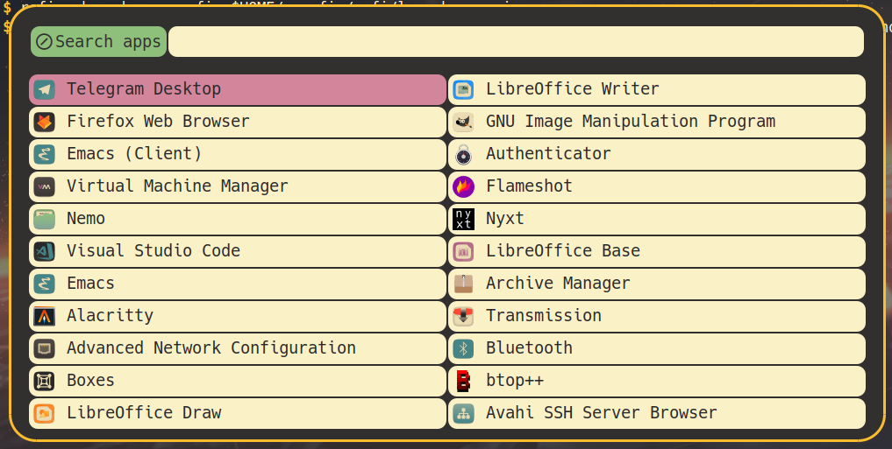
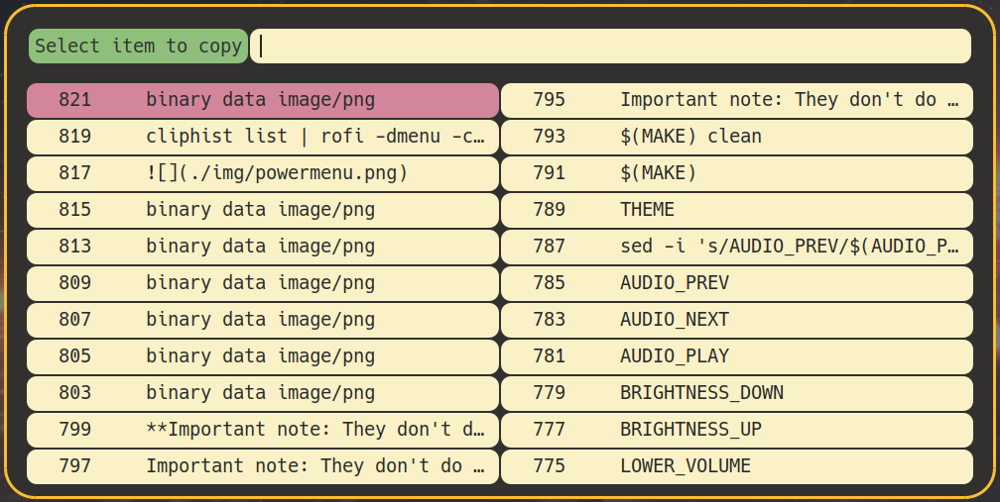

* Rofi widgets
** About
This repo contains rofi config files for launcher and clipboard.

**Important note: They don't do anything when using standalone except fancy help on keyboard shortcuts**

*** Launcher

*** Clipboard

** Installation
- Via top-level installer and config
  #+begin_src sh
    ./desktop-config-installer desktop.yaml
  #+end_src

- or manually
  Clone this repository to ~$HOME/.config/rofi~

  #+begin_src sh
    git clone https://github.com/VasKho/desktop-config
    cp -r desktop-config/modules/rofi  ~/.config/rofi
  #+end_src
