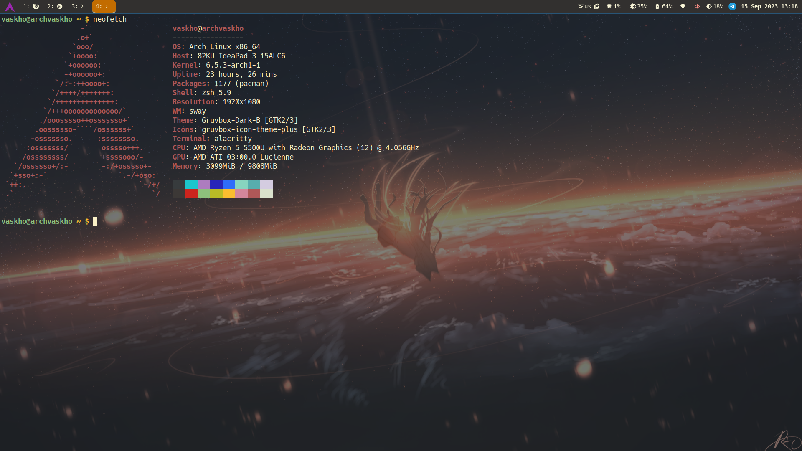
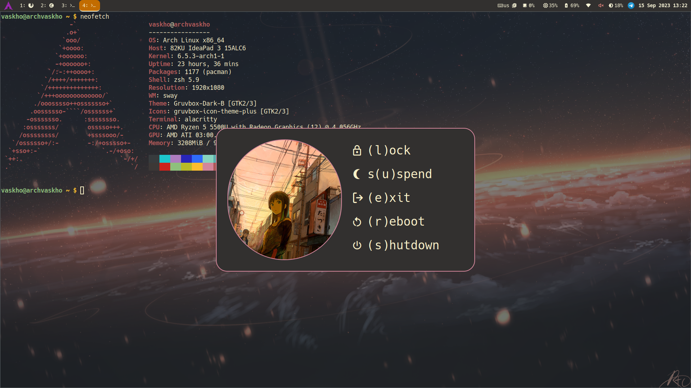
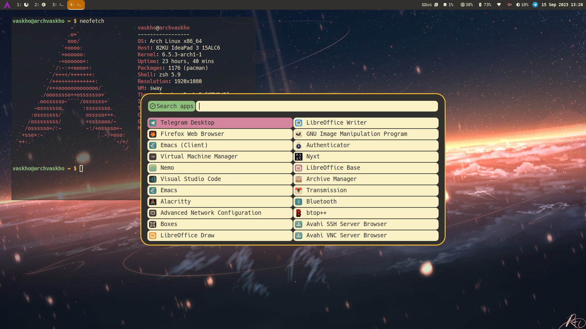
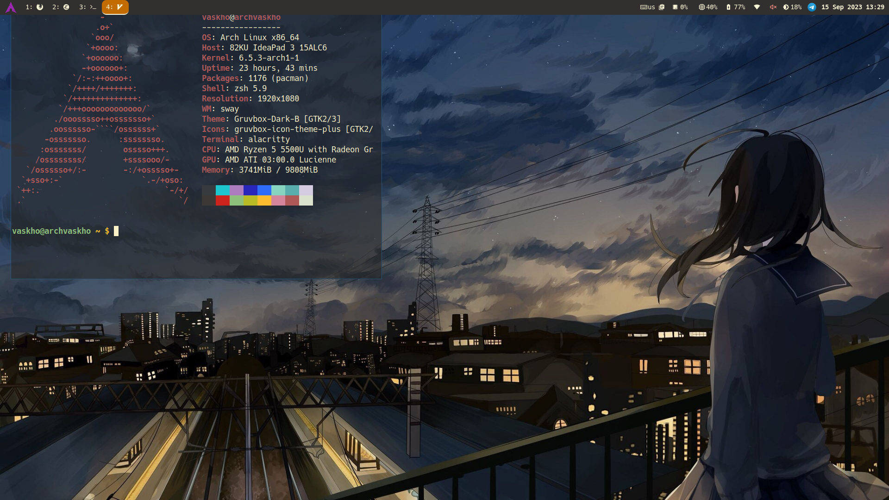

* Sway config

**  About

This module is for my sway configuration files.

** :sparkles: Preview

** :feelsgood: Features

- Easy customization top-level ~dektop.yaml~ config file
- Help menus for shortcuts in shutdown and screenshot modes
- Screenshots + screen recording
- Dynamic workspaces in bar via sworkstyle
- Custom themes support

** :floppy_disk: Quick start

Before starting an installation check whether you do have all necessary dependencies via and install those if you don't.

#+begin_src sh
  git clone https://github.com/VasKho/desktop-config
  ./desktop-config-installer desktop.yaml
#+end_src

or manually

#+begin_src sh
  git clone https://github.com/VasKho/desktop-config
  cp -r desktop-config/modules/sway  ~/.config/sway
#+end_src

*** :scroll: Requrements

To get this setup work you need to install some packages. Their list might be found in the table below.
Packages marked with ~**~ are optional, but config contains parts that depend on them.

|---------------------------+----------------------------------------------------------------------------------------|
| Package                   | Description                                                                            |
|---------------------------+----------------------------------------------------------------------------------------|
| ~systemd~                 | This config config relies on ~systemd~ commands to login, suspend, reboot and poweroff |
| ~wireplumber~             | Client for pipewire audio                                                              |
| ~brightnessctl~           | Simple screen brightness manager                                                       |
| ~playerctl~               | Media player controller                                                                |
| ~rofi~                    | Provides widgets for modes and menus                                                   |
| ~wl-clipboard~            | CLI clipboard utility                                                                  |
| ~autotiling~              | Helps to manage tiling layouts                                                         |
| ~sworkstyle~              | Used for beautiful workspace names in waybar                                           |
| ~foot~                    | Terminal                                                                               |
| ~slurp~                   | Utility to select on screen with cursor (used in screenshots and recordings)           |
| ~grim~                    | Screenshot tool                                                                        |
| ~wf-recorder~             | Screen recorder                                                                        |
| ~cliphist~                | Wayland clipboard manager                                                              |
| ~swaylock~                | Screen lock utility (I prefer ~swaylock-effects~)                                      |
| ~mako~                    | Notification daemon                                                                    |
| ~swaybg~                  | Wallpaper tool                                                                         |
| ~jq~                      | CLI JSON processor                                                                     |
| ~wl-mirror~               | Tool to mirror screen                                                                  |
| ~pipectl~                 | Dependency of ~wl-mirror~                                                              |
| ~nm-connection-editor~ ** | GUI app to manage network connections configurations                                   |
| ~networkmanager~ **       | ~nmtui~ is used in config                                                              |
| ~btop~ **                 | More convenient than ~htop~                                                            |
| ~telegram~ **             | Messenger                                                                              |
|---------------------------+----------------------------------------------------------------------------------------|

** :wrench: Configuration

For full list of current configuration options check the top-level ~desktop.yaml~ config file. It exports the given parameters as sway variables to ~vars.conf~ file.
You can adjust it anyway you want, just find the place to use those variables in config.

** :musical_keyboard: Default mappings

|-------------------------+------------------------------------------|
| Shortcut                | Function                                 |
|-------------------------+------------------------------------------|
| ~Super+Shift+c~         | Reload config                            |
| ~Super+Enter~           | Run terminal                             |
| ~Super+Shift+q~         | Kill active window                       |
| ~Super+Shift+Space~     | Toggle floating mode for active window   |
| ~Super+x~               | Run launcher                             |
| ~Super+p~               | Open clipboard                           |
| ~Super+Shift+p~         | Open clipboard for deleting              |
| ~Super+f~               | Toggle fullscreen mode for active window |
| ~Super+<number>~        | Change workspace (from 1 to 10)          |
| ~Super+Shift+<number>~  | Move window to workspace                 |
| ~Super+Shift+r~         | Start screen recording                   |
| ~Super+Escape~          | Stop screen recording                    |
| ~Super+m~               | Toggle messenger                         |
| ~Super+Shift+e~         | Open powermenu                           |
| ~Print~                 | Open screenshot menu                     |
| ~XF86AudioMute~         | Mute audio                               |
| ~XF86AudioMicMute~      | Mute micro                               |
| ~XF86AudioRaiseVolume~  | Raise volume                             |
| ~XF86AudioLowerVolume~  | Lower volume                             |
| ~XF86MonBrightnessUp~   | Raise brightness                         |
| ~XF86MonBrightnessDown~ | Lower brightness                         |
| ~XF86AudioPlay~         | Toggle audio playing                     |
| ~XF86AudioNext~         | Next song                                |
| ~XF86AudioPrev~         | Previous song                            |
| ~Super+Shift+m~         | Start screen mirroring                   |
|-------------------------+------------------------------------------|
